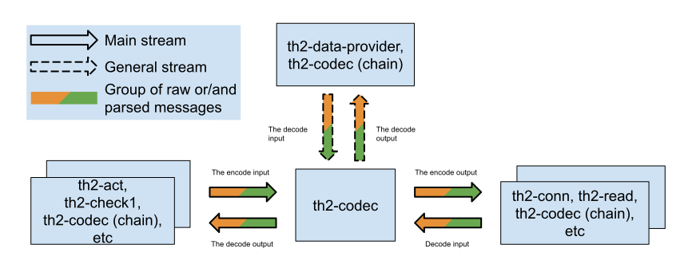

# Description (5.4.0)

This is a common codec library which takes care of some boilerplate stuff like subscribing/publishing to message queues, loading codec settings, etc.

# What is a codec?

The codec in th2 is a component that is responsible for transforming messages from human-readable format
into a format of a corresponding protocol and vice versa.
It contains the main logic for encoding and decoding messages.

The codec communicates with other components by sending batches with groups of parsed or/and raw messages.
During encoding, it transforms messages to the corresponding protocol format.
During decoding, it takes all raw messages that correspond to the codec protocol and transforms them according to its rules.

Several codecs can be joined into a chain of codecs to reuse already implemented codecs. For example, you have **HTTP**, **JSON** and **XML** codec.
You can join them together for decoding **XML** over **HTTP** or **JSON** over **HTTP**.

Here is a schema that illustrates the common place of the th2-codec component in th2.



# How to create your own codec?

To implement a codec using this library you need to:

1. add following repositories into `build.gradle`:

    ```groovy
    maven {
        url 'https://s01.oss.sonatype.org/content/repositories/snapshots/'
    }
    
    maven {
        url 'https://s01.oss.sonatype.org/content/repositories/releases/'
    }
    ```

2. add dependency on `com.exactpro.th2:codec:5.3.0-dev` into `build.gradle`

3. set main class to `com.exactpro.th2.codec.MainKt`

   > This is usually done by using Gradle's [application](https://docs.gradle.org/current/userguide/application_plugin.html) plugin where you can set main class like this:
   >```groovy
   >application {
   >    mainClassName 'com.exactpro.th2.codec.MainKt'
   >}
   >```

4. implement the codec itself by implementing [`IPipelineCodec`](https://github.com/th2-net/th2-codec/blob/2707a2755038d49110f6f7eb3e3aeb6188ae0c99/src/main/kotlin/com/exactpro/th2/codec/api/IPipelineCodec.kt#L21) interface:
    ```kotlin
    interface IPipelineCodec : AutoCloseable {
        fun encode(messageGroup: MessageGroup, context: IReportingContext): MessageGroup = TODO("encode(messageGroup: MessageGroup, context: IReportingContext) method is not implemented")
        fun decode(messageGroup: MessageGroup, context: IReportingContext): MessageGroup = TODO("decode(messageGroup: MessageGroup, context: IReportingContext) method is not implemented")
        fun encode(messageGroup: ProtoMessageGroup, context: IReportingContext): ProtoMessageGroup = TODO("encode(messageGroup: ProtoMessageGroup, context: IReportingContext) method is not implemented")
        fun decode(messageGroup: ProtoMessageGroup, context: IReportingContext): ProtoMessageGroup = TODO("decode(messageGroup: ProtoMessageGroup, context: IReportingContext) method is not implemented")

        override fun close() {}
    }
    ```

5. implement a factory for it using [`IPipelineCodecFactory`](https://github.com/th2-net/th2-codec/blob/2707a2755038d49110f6f7eb3e3aeb6188ae0c99/src/main/kotlin/com/exactpro/th2/codec/api/IPipelineCodecFactory.kt#L21) interface

    ```kotlin
    interface IPipelineCodecFactory : AutoCloseable {
        val protocols: Set<String>
        val settingsClass: Class<out IPipelineCodecSettings>
        fun init(dictionary: InputStream): Unit = TODO("not implemented")
        fun init(pipelineCodecContext: IPipelineCodecContext): Unit = pipelineCodecContext[DictionaryType.MAIN].use(::init)
        fun create(settings: IPipelineCodecSettings? = null): IPipelineCodec
        override fun close() {}
    }
    ```
   > **NOTE**: both `init` methods have default implementations. One of them **must** be overridden in your factory implementation.
   > If your codec needs the **MAIN** dictionary only you can override the `init(dictionary: InputStream)` method.
   > Otherwise, you should override `init(pipelineCodecContext: IPipelineCodecContext)` method.

   > **IMPORTANT**: implementation should be loadable via Java's built-in [service loader](https://docs.oracle.com/javase/9/docs/api/java/util/ServiceLoader.html)

6. Et voilà! Your codec is now complete

# How it works:

Codec operates with [message groups](https://github.com/th2-net/th2-grpc-common/blob/f2794b2c5c8ae945e7500677439809db9c576c43/src/main/proto/th2_grpc_common/common.proto#L97)
whom may contain a mix of [raw](https://github.com/th2-net/th2-grpc-common/blob/f2794b2c5c8ae945e7500677439809db9c576c43/src/main/proto/th2_grpc_common/common.proto#L84)
and [parsed](https://github.com/th2-net/th2-grpc-common/blob/f2794b2c5c8ae945e7500677439809db9c576c43/src/main/proto/th2_grpc_common/common.proto#L78) messages.

## Encoding

During encoding codec must replace each parsed message of supported [protocols](https://github.com/th2-net/th2-grpc-common/blob/f2794b2c5c8ae945e7500677439809db9c576c43/src/main/proto/th2_grpc_common/common.proto#L47)
in a message group with a raw one by encoding parsed message's content

> **NOTE**: codec can merge content of subsequent raw messages into a resulting raw message  
> (e.g. when a codec encodes only a transport layer and its payload is already encoded)

## Decoding

During decoding codec must replace each raw message in a message group with a parsed one by decoding raw message's content. \
If exception was thrown, all raw messages will be replaced with th2-codec-error parsed messages

> **NOTE**: codec can replace raw message with a parsed message followed by several raw messages
> (e.g. when a codec decodes only a transport layer it can produce a parsed message for the transport layer and several raw messages for its payload)

# MQ connections

Codec has eight types of connection: stream and general for encode and decode functions, using Protobuf or th2 transport protocol.

* stream encode / decode connections works 24 / 7
* general encode / decode connections works on demand

Codec never mixes messages from the _stream_ and the _general_ connections

# gRPC connections

Codec provides [gRPC service](https://github.com/th2-net/th2-grpc-codec/blob/master/src/main/proto/th2_grpc_codec/codec.proto) and can be connected to the next codec in pipeline via `grpc-client` pin.
First codec in pipeline should be marked by setting `custom-config` field `isFirstCodecInPipeline` to `true` (this switches on verification of pipeline output during encoding).

Codec never mixes messages from the _MQ_ and the _gRPC_ connections

## Transport lines

transportLines responsible for number of independent encoding / decoding lines. Each transport lines has options:
* type - has enum [`PROTOBUF`, `TH2_TRANSPORT`] value. Codec creates suitable type of message processor according this option.
NOTE: Support of each transport depends on child codec implementation.
* useParentEventId - In both options codec attaches event about encode/decode problem to codec root event. 
  If useParentEventId property is true, codec also attaches event with link to main problem event to each parent event ids from processed messages.

```yaml
apiVersion: th2.exactpro.com/v2
kind: Th2Box
metadata:
   name: codec
spec:
   customConfig:
      transportLines:
        "":
          type: PROTOBUF
          useParentEventId: false
        general:
           type: PROTOBUF
           useParentEventId: true
        transport:
           type: TH2_TRANSPORT
           useParentEventId: false
        general_transport:
           type: TH2_TRANSPORT
           useParentEventId: true
   pins:
     mq:
        subscribers:
#          prefix "" 
           - name: in_codec_decode
             attributes:
                - decoder_in
                - raw
                - subscribe
           - name: in_codec_encode
             attributes:
                - encoder_in
                - parsed
                - subscribe
#          prefix "general" 
           - name: in_codec_general_decode
             attributes:
                - general_decoder_in
                - raw
                - subscribe
           - name: in_codec_general_encode
             attributes:
                - general_encoder_in
                - parsed
                - subscribe
#          prefix "transport" 
           - name: in_codec_transport_decode
             attributes:
                - transport_decoder_in
                - transport-group
                - subscribe
           - name: in_codec_transport_encode
             attributes:
                - transport_encoder_in
                - transport-group
                - subscribe
#          prefix "general_transport" 
           - name: in_codec_general_transport_decode
             attributes:
                - general_transport_decoder_in
                - transport-group
                - subscribe
           - name: in_codec_general_transport_encode
             attributes:
                - general_transport_encoder_in
                - transport-group
                - subscribe
        publishers:
#          prefix ""
           - name: out_codec_decode
             attributes:
                - decoder_out
                - parsed
                - publish
           - name: out_codec_encode
             attributes:
                - encoder_out
                - raw
                - publish
#          prefix "general"
           - name: out_codec_general_decode
             attributes:
                - general_decoder_out
                - parsed
                - publish
           - name: out_codec_general_encode
             attributes:
                - general_encoder_out
                - raw
                - publish
#          prefix "transport"
           - name: out_codec_transport_decode
             attributes:
                - transport_decoder_out
                - transport-group
                - publish
           - name: out_codec_transport_encode
             attributes:
                - transport_encoder_out
                - transport-group
                - publish
#          prefix "general_transport"
           - name: out_codec_general_transport_decode
             attributes:
                - general_transport_decoder_out
                - transport-group
                - publish
           - name: out_codec_general_transport_encode
             attributes:
                - general_transport_encoder_out
                - transport-group
                - publish
```

## Codec settings

Codec core has the following parameters:

**codecSettings** - the implementation codec settings. These settings will be loaded as an instance of `IPipelineCodecFactory.settingsClass` during start up and then passed to every invocation
of `IPipelineCodecFactory.create` method

**enableVerticalScaling** - this setting allow to control vertical scaling mode. Codec splits an incoming batch into message groups and process each of them via the ForkJoinPool.commonPool(). The default value is `false`.
Please note this is experimental feature. Default value is `false`.

**isFirstCodecInPipeline** - specifies that this codec is the first codec in gRPC pipeline. Default value is `false`.

**disableMessageTypeCheck** - disable message type (`RawMessage`/`ParsedMessage`) check during processing. Normally codec does not try to encode `RawMessage` and don't try to decode `ParsedMessage`. Default value is `false`.

**disableProtocolCheck** - disable protocol check during processing. Default value is `false`.

**eventPublication** - section to configure batching parameters (block is not required)

+ **flushTimeout** - maximum time in milliseconds to hold a batch before publication. _Default value is 1000_.
+ **batchSize** - maximum number of events in one batch. _Default value is 100_

For example:

```yaml
apiVersion: th2.exactpro.com/v2
kind: Th2Box
metadata:
  name: codec
spec:
  customConfig:
    enableVerticalScaling: false
    isFirstCodecInPipeline: true
    disableMessageTypeCheck: false
    disableProtocolCheck: false
    eventPublication:
       flushTimeout: 1000
       batchSize: 100
    codecSettings:
      messageTypeDetection: BY_INNER_FIELD
      messageTypeField: "messageType"
      rejectUnexpectedFields: true
      treatSimpleValuesAsStrings: false
```

## Default pins

Pins are a part of the main th2 concept. They describe what are the inputs and outputs of a box.
You can read more about them [here](https://github.com/th2-net/th2-documentation/wiki/infra:-Theory-of-Pins-and-Links#pins).

Every type of connection has two `subscribe` and `publish` pins.
The first one is used to receive messages to decode/encode while the second one is used to send decoded/encoded messages further.
**Configuration should include at least one pin for each of the following sets of attributes:**
+ Pin for the stream encoding input: `encoder_in` `parsed` `subscribe`
+ Pin for the stream encoding output: `encoder_out` `raw` `publish`
+ Pin for the general encoding input: `general_encoder_in` `parsed` `subscribe`
+ Pin for the general encoding output: `general_encoder_out` `raw` `publish`
+ Pin for the stream decoding input: `decoder_in` `raw` `subscribe`
+ Pin for the stream decoding output: `decoder_out` `parsed` `publish`
+ Pin for the stream decoding input: `general_decoder_in` `raw` `subscribe`
+ Pin for the stream decoding output: `general_decoder_out` `parsed` `publish`
  
+ Pin for the stream encoding input: `transport_encoder_in` `transport-group` `subscribe`
+ Pin for the stream encoding output: `transport_encoder_out` `transport-group` `publish`
+ Pin for the general encoding output: `transport_general_encoder_out` `transport-group` `publish`
+ Pin for the general encoding input: `transport_general_encoder_in` `transport-group` `subscribe`
+ Pin for the stream decoding input: `transport_decoder_in` `transport-group` `subscribe`
+ Pin for the stream decoding output: `transport_decoder_out` `transport-group` `publish`
+ Pin for the stream decoding input: `transport_general_decoder_in` `transport-group` `subscribe`
+ Pin for the stream decoding output: `transport_general_decoder_out` `transport-group` `publish`

### Configuration example

This configuration is a general way for deploying components in th2.
It contains box configuration, pins' descriptions and other common parameters for a box.

Here is an example of configuration for component based on th2-codec:

```yaml
apiVersion: th2.exactpro.com/v2
kind: Th2Box
metadata:
  name: codec
spec:
  customConfig:
    enableVerticalScaling: false
    isFirstCodecInPipeline: true
    disableMessageTypeCheck: false
    disableProtocolCheck: false
    codecSettings:
      parameter1: value
      parameter2:
        - value1
        - value2
    transportLines:
       transport:
          type: TH2_TRANSPORT
          useParentEventId: true
    pins:
       mq:
          subscribers:
             - name: in_codec_transport_decode
               attributes:
                  - transport_decoder_in
                  - transport-group
                  - subscribe
             - name: in_codec_transport_encode
               attributes:
                  - transport_encoder_in
                  - transport-group
                  - subscribe
          publishers:
             - name: out_codec_transport_decode
               attributes:
                  - transport_decoder_out
                  - transport-group
                  - publish
             - name: out_codec_transport_encode
               attributes:
                  - transport_encoder_out
                  - transport-group
                  - publish
```

## Message routing

Schema API allows configuring routing streams of messages via links between connections and filters on pins.
Let's consider some examples of routing in codec box.

### Split on 'publish' pins

For example, you got a big source data stream, and you want to split them into some pins via session alias.
You can declare multiple pins with attributes `['transport_decoder_out', 'transport-group', 'publish']` and filters instead of common pin or in addition to it.
Every decoded messages will be direct to all declared pins and will send to MQ only if it passes the filter.

```yaml
apiVersion: th2.exactpro.com/v2
kind: Th2Box
metadata:
  name: codec
spec:
   pins:
      mq:
         publishers:
            # decoder
            - name: out_codec_transport_decode_first_session_alias
              attributes:
                 - transport_decoder_out
                 - transport-group
                 - publish
              filters:
                - metadata:
                    - expectedValue: "first_session_alias_*"
                      fieldName: session_alias
                      operation: WILDCARD
            - name: out_codec_transport_decode_second_session_alias
              attributes:
                 - transport_decoder_out
                 - transport-group
                 - publish
              filters:
                 - metadata:
                      - expectedValue: "second_session_alias_*"
                        fieldName: session_alias
                        operation: WILDCARD
```

The filtering can also be applied for pins with `subscribe` attribute.

## Changelog

### v5.4.0

* added event batching before publication
* batching parameters can be configured in `eventPublication` section

### v5.3.0

* th2 transport protocol support
* added transport lines to declare several independent encode/decode groups
* gRPC connection support

### v5.2.0

* Updated common to 5.2.0-dev

### v5.1.0

* Merged v4.8.0 version

### v5.0.1

* Merged v4.7.6 version

### v5.0.0

* Migrated to book & page concept

### v4.8.0

#### Changed:

+ Added enableVerticalScaling option

### v4.8.1
#### Updated:
+ bom to `4.2.0`
+ common to `3.44.1`

### v4.8.0

#### Changed:

+ Added enableVerticalScaling option

### v4.7.6

#### Fixed:

+ Uses common approach to run the application via command line.

### v4.7.5

#### Updated:

+ bom to `4.1.0`
* common to `3.44.0`

#### Added:

* Vulnerabilities check

### v4.7.4

#### Changed:

* Updated common and BOM versions to remove vulnerable dependencies

### v4.7.3

#### Changed:

* Message groups are processed concurrently inside message batches

### v4.7.2

#### Fixed:

* Codec now publishes an error event and an error message successfully when it cannot parse a th2-message. 
This functionality was broken as `NullPointerException` was thrown during the creation of an error message 

### v4.7.1

#### Feature:

* Generate error messages with parent event id from an error event

### v4.7.0

#### Added:

* Error logs and error events are made more informative (added custom `ValidateException` for validating incoming messages)

### v4.6.1

#### Fixed:

* Codec continued to work when implementation instance cannot be created

### v4.6.0

#### Fixed:

* Errors and warnings during encoding does not have message IDs attached because the IDs are not correct yet

#### Added:

* Codec can report warnings during decoding and encoding message groups

#### Changed:

* Root codec event's name now uses box name
* The general encode/decode does not use `parentEventId` from messages when reporting errors and warnings
* The error/warning events are now attached to the root codec event.
* The error/warning event is attached to the event that is specified in `parentEventId` as a reference to an event in codec root.

### v4.5.0

#### Feature:

* Ability to read more than one dictionary from box configuration in PipelineCodecFactory
* Pipeline codec implementations can declare several protocols to process, not just one  
* Transfers already processed groups through codec without changes,
  for example, encoder transfers groups with raw messages only and vice versa 

### v4.4.0

#### Feature:

* In group required to have all messages (raw messages for decode and parsed for encode) with empty protocol or all filled 
* Failed protocol assertion produce error message in decode processor

### v4.3.0

#### Feature:

* Error event will be sent for each original event id of the message group
* Common version update to 3.32.0
* bom version update to 3.1.0

### v4.2.0

#### Feature:

* In case of decoding error, instead of skipping the group, replace raw messages of empty or target protocol with `th2-codec-error` message in them

### v4.1.1

#### Fixed:

* incorrect protocol checking during encoding